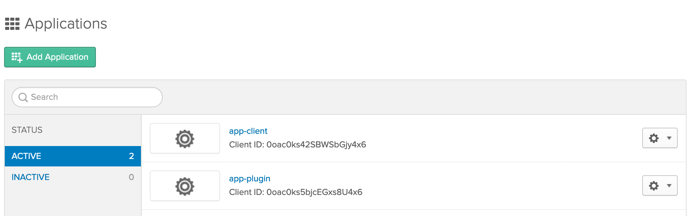
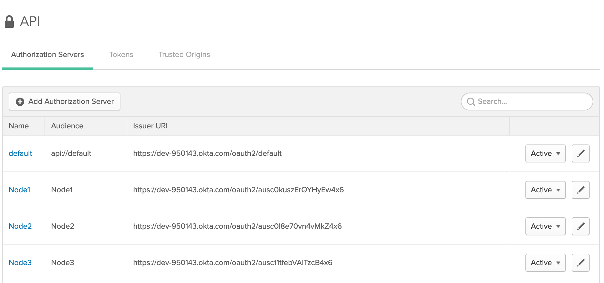
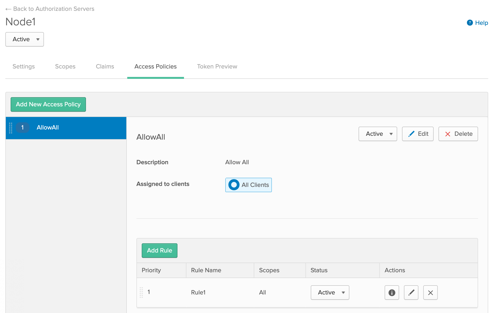

In this guide, we are going to set up a 3-node Quorum Network using Istanbul consensus. Each Quorum node exposes JSON RPC
via HTTP which is TLS-enabled and protected by Quorum Security Plugin.

We use Docker and Docker Compose ([Docker Engine](https://docs.docker.com/engine/) or [Docker Desktop](https://www.docker.com/products/docker-desktop))
to simplify the setup. Please make sure you have it installed.

Clone this repo
```
$ git clone https://github.com/jpmorganchase/quorum-plugin-security
$ cd quorum-plugin-security/examples
```

## Using ORY Hydra

This provides an example on how to configure the plugin to work with [ORY Hydra](https://github.com/ory/hydra)
which is a server implementation of the OAuth2 authorization framework.

- Start Quorum and the Authorization Server
    ```
    $ docker-compose -f quorum.yml -f hydra.yml up -d
    ```
- Verify that we are not able to do `geth attach`
    ```
    $ docker-compose -f quorum.yml exec node0 geth attach https://localhost:8545 --rpcclitls.insecureskipverify
    Fatal: Failed to start the JavaScript console: api modules: missing access token
    ```
- Verify that we are NOT able to `curl` JSON RPC
    ```
    $ curl -k -X POST https://localhost:22000 -H "Content-type: application/json" \
             --data '{"jsonrpc":"2.0","method":"eth_blockNumber","params":[],"id":1}'
    {"jsonrpc":"2.0","id":1,"error":{"code":-32001,"message":"missing access token"}}
    ```
- Create a client and grant some scopes in the authorization server
    ```
    $ docker-compose -f quorum.yml -f hydra.yml exec auth-server \
        hydra clients create \
        --endpoint http://localhost:4445 \
        --id my-client \
        --secret my-secret \
        -g client_credentials \
        --audience "Node1,Node2" \
        --scope "rpc://rpc_modules,rpc://eth_*,rpc://admin_nodeInfo"
    Config file not found because "Config File ".hydra" Not Found in "[/home/ory]""
    You should not provide secrets using command line flags, the secret might leak to bash history and similar systems
    OAuth 2.0 Client ID: my-client
    ```
    Ignore this message:
    > Config file not found because "Config File ".hydra" Not Found in "[/home/ory]""
    >
    > You should not provide secrets using command line flags, the secret might leak to bash history and similar systems
- Obtain access token and assign the output (exclude the message) to an environment variable `TOKEN`
    ```
    $ docker-compose -f quorum.yml -f hydra.yml exec auth-server \
        hydra token client --endpoint http://localhost:4444/ \
        --client-id my-client \
        --client-secret my-secret \
        --audience "Node1,Node2" \
        --scope "rpc://rpc_modules,rpc://eth_*,rpc://admin_nodeInfo"
    Config file not found because "Config File ".hydra" Not Found in "[/home/ory]""
    eyJh..<snip>..W0
    $ export TOKEN="Bearer <the output ehJh..<snip>..W0 above>"
    ```
    Ignore this message:
    > Config file not found because "Config File ".hydra" Not Found in "[/home/ory]""
- Verify that we are now able to `geth attach`
    ```
    $ docker-compose -f quorum.yml exec node0 geth attach https://localhost:8545 \
            --rpcclitls.insecureskipverify \
            --rpcclitoken $TOKEN
    Welcome to the Geth JavaScript console!

     modules: admin:1.0 debug:1.0 eth:1.0 istanbul:1.0 miner:1.0 net:1.0 personal:1.0 rpc:1.0 txpool:1.0 web3:1.0

    >
    ```
- You can try some calls like: `eth.blockNumber` but you would get "access denied" when trying `admin.peers`
- Verify that we are now able to `curl` JSON RPC with additional `Authorization` request header:
    ```
    $ curl -k -X POST https://localhost:22000 -H "Content-type: application/json" \
             -H "Authorization: $TOKEN" \
           --data '{"jsonrpc":"2.0","method":"eth_blockNumber","params":[],"id":1}'
    {"jsonrpc":"2.0","id":1,"result":"0x188"}
    ```
## Using Okta

This provides an example on how to configure the plugin to work with Okta service.

- Create a [developer account in Okta](https://developer.okta.com/)
- From `Applications` menu: create 2 applications of type `Service`, named them: `app-client`, and `app-plugin`
    - `app-client` represents a client whose credentials are to obtain access token.
    - `app-plugin` represents a client whose credentials are to verify access token. In our case, it's the security plugin.
    
    > By convention, we are going to refer `<app-plugin Client ID>` as the value of `Client ID` from `app-plugin` application.
    Similarly, we have `<app-plugin Client Secret>`, `<app-client Client ID>` and `<app-client Client Secret>`.
- From `API -> Authorization Servers` menu: create 3 authorization servers:
    > As Okta only allows one audience per authorization server hence we need to have one authorization server per node
    - Name: `Node1`, Audience: `Node1`
    - Name: `Node2`, Audience: `Node2`
    - Name: `Node3`, Audience: `Node3`
    
    - From `Scopes` tab in each authorization server above, add the following:
        - `rpc://admin_nodeInfo`
        - `rpc://eth_*`
        - `rpc://rpc_modules`
    
    - From `Access Policies` tab in each authorization server above, create a policy to allow all
    
    - Obtain the following information from JSON output of `Metadata URI` in each authorization server's Settings page:
        - `issuer`
        - `token_endpoint`
        - `introspection_endpoint`

       > By convention, we are going to refer `<issuer 1>` as the value of `issuer` from `Node1` Metadata. Similarly,
       we have `<issuer 2>`, `<issuer 3>`, `<token_endpoint 1>` ... and so on.
- Run `okta-helper.sh`, follow the prompts and provide values as convention above
    ```
    $ ./okta-helpoer.sh
    <app-plugin Client ID> 0oac0ks5bjcEGxs8U4x6
    <app-plugin Client Secret> ***
    Populate okta-config.json for node 1
    <issuer 1> https://dev-950143.okta.com/oauth2/ausc0kuszErQYHyEw4x6
    <introspection_endpoint 1> https://dev-950143.okta.com/oauth2/ausc0kuszErQYHyEw4x6/v1/introspect
    Populate okta-config.json for node 2
    <issuer 2> https://dev-950143.okta.com/oauth2/ausc0l8e70vn4vMkZ4x6
    <introspection_endpoint 2> https://dev-950143.okta.com/oauth2/ausc0l8e70vn4vMkZ4x6/v1/introspect
    Populate okta-config.json for node 3
    <issuer 3> https://dev-950143.okta.com/oauth2/ausc11tfebVAiTzcB4x6
    <introspection_endpoint 3> https://dev-950143.okta.com/oauth2/ausc11tfebVAiTzcB4x6/v1/introspect
    ```
- Start Quorum with Okta support
    ```
    $ docker-compose -f quorum.yml -f okta.yml up -d
    ```
- Verify that we are not able to do `geth attach`
    ```
    $ docker-compose -f quorum.yml exec node0 geth attach https://localhost:8545 --rpcclitls.insecureskipverify
    Fatal: Failed to start the JavaScript console: api modules: missing access token
    ```
- Verify that we are NOT able to `curl` JSON RPC
    ```
    $ curl -k -X POST https://localhost:22000 -H "Content-type: application/json" \
             --data '{"jsonrpc":"2.0","method":"eth_blockNumber","params":[],"id":1}'
    {"jsonrpc":"2.0","id":1,"error":{"code":-32001,"message":"missing access token"}}
    ```
- Obtain access token and assign the output (exclude the message) to an environment variable `TOKEN`
    ```
    $ export TOKEN_ENDPOINT=<token_endpoint 1>
    $ export CLIENT_ID=<app-client Client ID>
    $ export CLIENT_SECRET=<app-client Client Secret>
    $ curl -X POST $TOKEN_ENDPOINT --data \
    "client_id=$CLIENT_ID&client_secret=$CLIENT_SECRET&grant_type=client_credentials&scope=rpc://eth_* rpc://admin_nodeInfo rpc://rpc_modules"
    {"token_type":"Bearer","expires_in":3600,"access_token":"..<snip>..","scope":"rpc://admin_nodeInfo rpc://eth_* rpc://rpc_modules"}
    $ export TOKEN="Bearer <the access_token value>"
    ```
- Verify that we are now able to `geth attach`
    ```
    $ docker-compose -f quorum.yml exec node0 geth attach https://localhost:8545 \
            --rpcclitls.insecureskipverify \
            --rpcclitoken $TOKEN
    Welcome to the Geth JavaScript console!

     modules: admin:1.0 debug:1.0 eth:1.0 istanbul:1.0 miner:1.0 net:1.0 personal:1.0 rpc:1.0 txpool:1.0 web3:1.0

    >
    ```
- You can try some calls like: `eth.blockNumber` but you would get "access denied" when trying `admin.peers`
- Verify that we are now able to `curl` JSON RPC with additional `Authorization` request header:
    ```
    $ curl -k -X POST https://localhost:22000 -H "Content-type: application/json" \
             -H "Authorization: $TOKEN" \
           --data '{"jsonrpc":"2.0","method":"eth_blockNumber","params":[],"id":1}'
    {"jsonrpc":"2.0","id":1,"result":"0x188"}
    ```